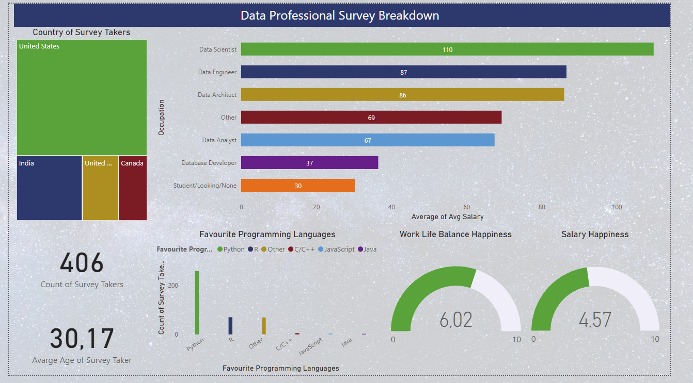

# Data Analytics Survey Analysis

## Overview

In this project, I conducted an in-depth analysis of survey results gathered from individuals either currently working in the expansive field of data analytics or those in the process of transitioning or studying to enter the analytics industry. The survey drew participation from over 400 respondents and covered a wide range of questions, including demographics (age, current job positions, and annual earnings) and job satisfaction aspects (favorite programming languages, contentment with work-life balance, job satisfaction, and compensation).

## Data Processing

The initial dataset, provided in Excel, underwent meticulous data cleaning to ensure accuracy. The data was then migrated to PowerBI, where Power Query was employed to eliminate incomplete entries, modify data formats, and rectify inaccuracies in responses. Additionally, using Data Analysis Expressions (DAX), further computations were performed, such as determining the average earnings across different roles in the data analytics industry.

## Interactive Dashboard

The culmination of the project is a comprehensive and interactive dashboard created in PowerBI. The dashboard provides valuable insights, including:

- **Country Demographics:** Visual representation of the geographic distribution of survey participants.
- **Age Distribution:** Analysis of the average age of respondents.
- **Programming Languages:** Insights into the preferred programming languages among participants.
- **Satisfaction Factors:** Detailed examination of factors influencing job satisfaction.

---
.
